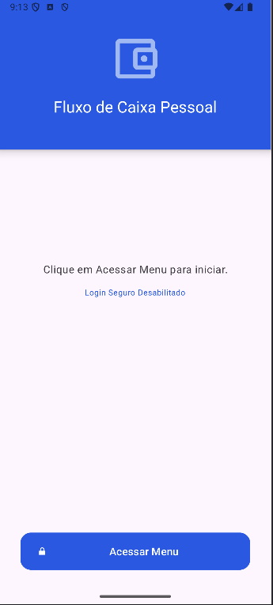
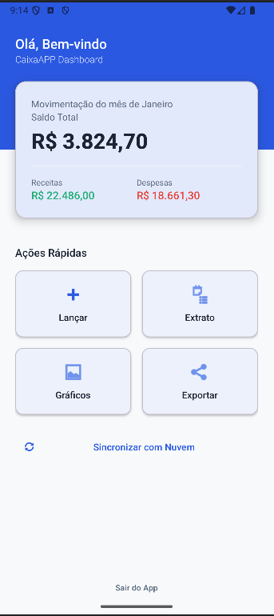
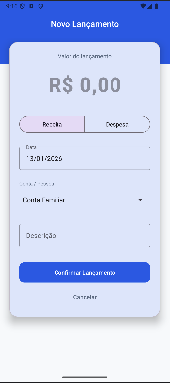
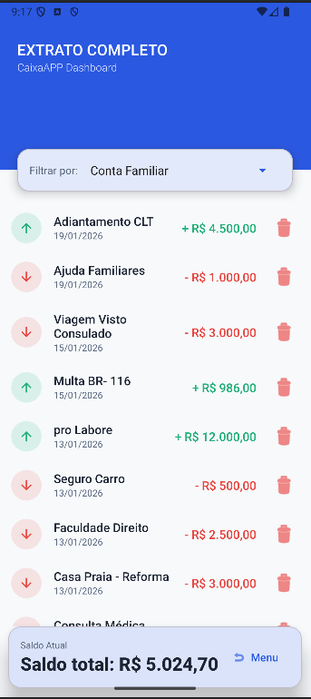
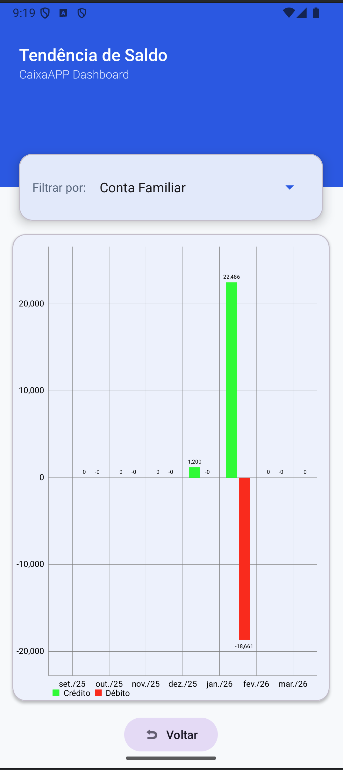

# CaixaAPP - Fluxo de Caixa Pessoal

  

  
  
  
  
  
  

---

## Índice

- [Sobre o Projeto](#sobre-o-projeto)
- [Contexto Acadêmico](#contexto-acadêmico)
- [Persona e Problema](#persona-e-problema)
- [Funcionalidades](#funcionalidades)
- [Screenshots](#screenshots)
- [Arquitetura](#arquitetura)
- [Tech Stack](#tech-stack)
- [Estrutura do Projeto](#estrutura-do-projeto)
- [Como Executar](#como-executar)
- [Checklist de Avaliação](#checklist-de-avaliação)
- [Roadmap](#roadmap)
- [Licença](#licença)

---

## Sobre o Projeto

O **CaixaAPP** é um aplicativo Android nativo desenvolvido em Kotlin para **controle financeiro pessoal e familiar**. Permite registrar receitas e despesas, visualizar extratos detalhados, acompanhar a tendência de saldo através de gráficos e exportar dados em múltiplos formatos.

O sistema foi projetado pensando na **gestão financeira colaborativa**, permitindo que diferentes membros de um núcleo familiar registrem suas movimentações e visualizem tanto suas finanças individuais quanto a consolidação familiar.

---

## Contexto Acadêmico

Este projeto foi desenvolvido como **Trabalho Final** da disciplina de **Android Aplicado** do curso de Pós-Graduação em **Dispositivos Móveis** da **UTFPR - Campus Pato Branco**.

> *"A descrição do trabalho a seguir já foi utilizado para contratação de programadores Junior/Pleno em uma empresa de software de médio porte"*
> — Enunciado do Desafio Técnico

---

## Persona e Problema

### O Problema

Muitas pessoas possuem um volume considerável de entradas e saídas financeiras durante o mês, mas **não têm noção real do seu poder aquisitivo**. Isso dificulta:

- A manutenção do orçamento doméstico
- O planejamento de gastos futuros
- A busca por prosperidade e segurança financeira no lar

### A Persona

Indivíduo ou família que:

- Possui múltiplas fontes de receita e despesa
- Precisa de visibilidade clara sobre custos mensais
- Deseja controlar finanças de forma compartilhada (cônjuge, filhos)
- Necessita exportar dados para análises externas ou declarações

### A Solução

O **CaixaAPP** oferece:

- Visão consolidada do saldo, receitas e despesas
- Múltiplos prismas - lançamentos por pessoa ou família
- Exportação de dados em PDF, XML ou JSON
- Gráfico de tendência para análise de 6 meses
- Interface intuitiva seguindo Material Design 3

---

## Funcionalidades

### Funcionalidades Core (Requisitos do Trabalho)

| Funcionalidade | Descrição |
|----------------|-----------|
| Tela de Lançamento | Cadastro de receitas/despesas com valor, descrição, data e tipo |
| Tela de Extrato | Listagem completa das movimentações com RecyclerView |
| Persistência Local | Banco de dados Room (SQLite) para armazenamento offline |
| DatePicker | Seleção de data via MaterialDatePicker nativo |
| Diferenciação Visual | Cores semânticas (verde/vermelho) e ícones para crédito/débito |
| Exibição de Saldo | Resumo financeiro com saldo total calculado |

### Funcionalidades Extras (Diferenciais)

| Funcionalidade | Descrição |
|----------------|-----------|
| Dashboard Principal | Health check financeiro com saldo, receitas e despesas do mês |
| Multi-Pessoa | Lançamentos atribuídos a diferentes membros da família |
| Filtro por Pessoa | Visualização individual ou consolidada (família) |
| Gráfico de Tendência | Visualização de 6 meses com barras de crédito/débito |
| Exportação | Geração de relatórios em PDF, XML e JSON |
| Login Seguro | Preparado para autenticação biométrica (desabilitável) |
| Exclusão de Lançamentos | Remoção com confirmação via AlertDialog |

---

## Screenshots

  
  
  
  

  
  
  

| Tela | Descrição |
|------|-----------|
| Login | Tela inicial com opção de login seguro (biometria) - desabilitável para desenvolvimento |
| Dashboard | Visão geral com saldo total, receitas e despesas do mês + ações rápidas |
| Lançamento | Formulário para nova movimentação com máscara monetária e DatePicker |
| Extrato | Lista de transações com filtro por pessoa, diferenciação visual e opção de exclusão |
| Gráfico | Tendência de 6 meses com barras comparativas de crédito (verde) e débito (vermelho) |
| Exportar | Modal com opções de formato: PDF, XML ou JSON |
| Sync | Placeholder para funcionalidade futura de sincronização com nuvem (pós-aula API) |

---

## Arquitetura

O projeto segue o padrão MVC (Model-View-Controller) conforme uma das opções nos requisitos iniciais para entrega até o dia 15/fev.

Em versões futuras, para Go to Market estamos avaliando migrar para MVVM (Model-View-ViewModel) com separação clara de responsabilidades e testabilidade unitária.

### Diagrama de Fluxo Atual (MVC)
